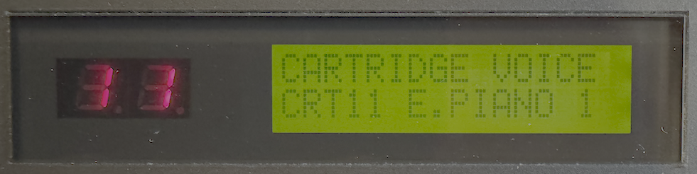
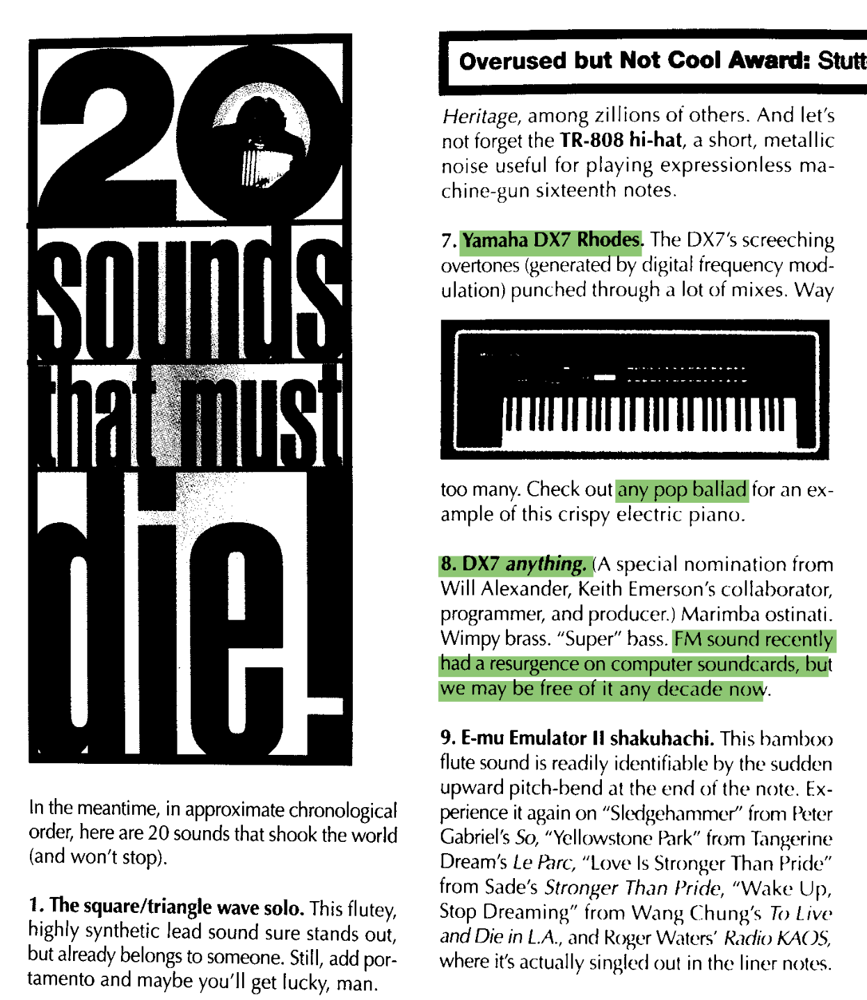
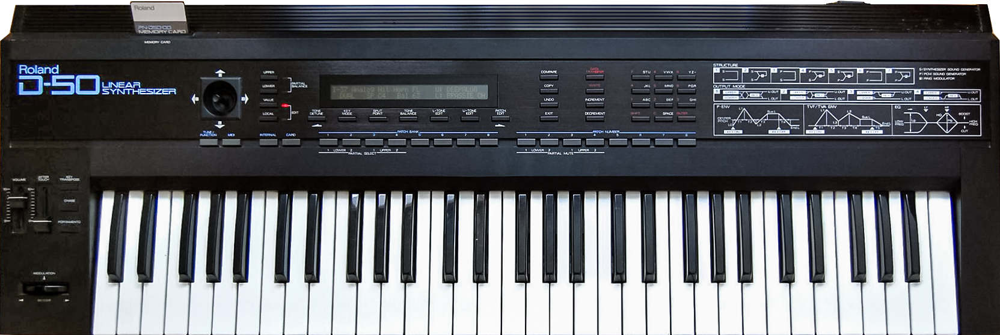
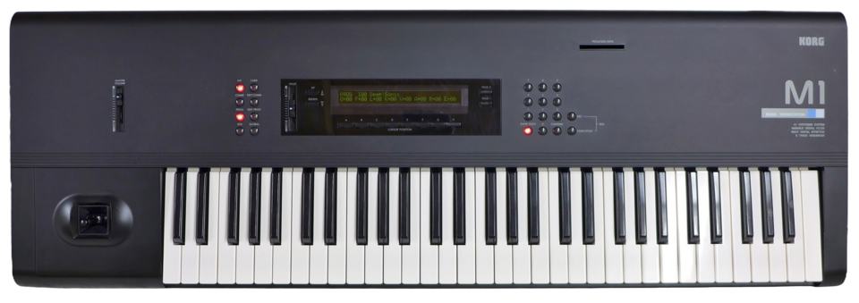
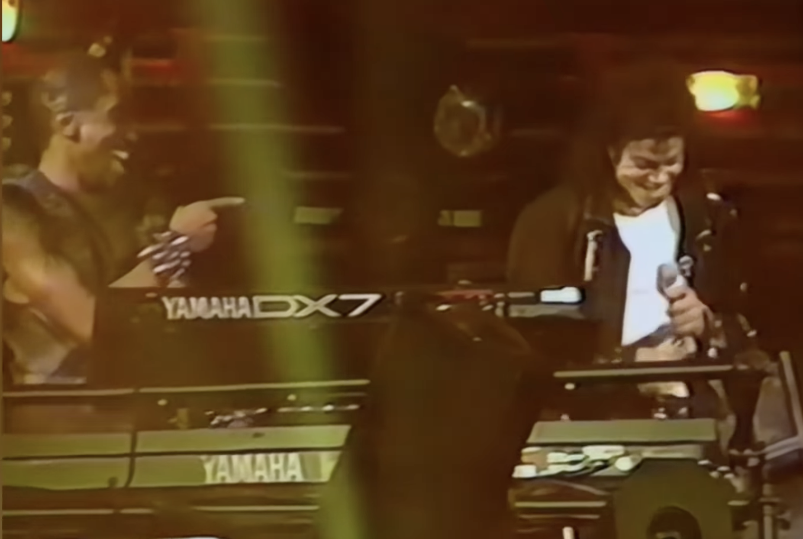
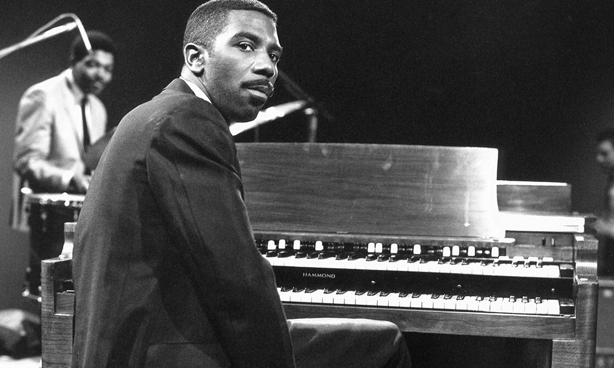
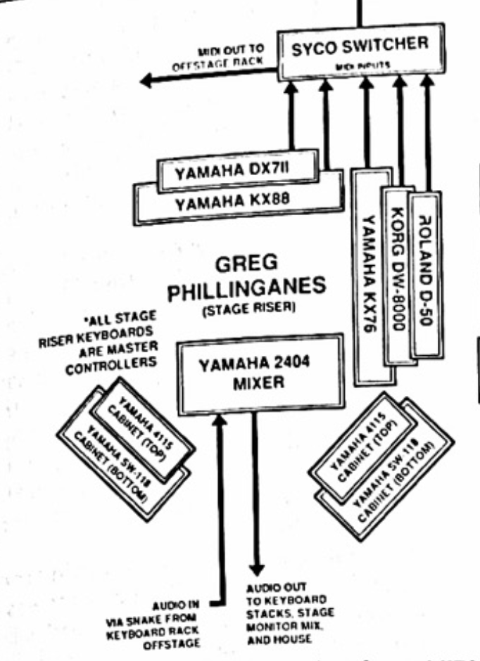
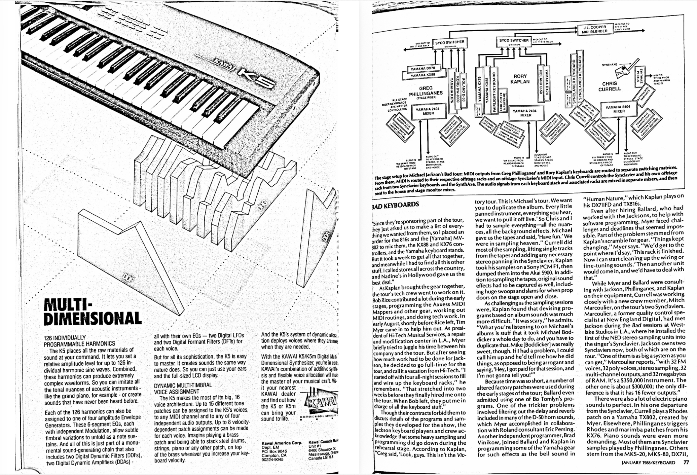

<!-- .slide: data-background-color="#10100b" data-background-image="img/dx7-bg2.png" data-background-position="top right" data-background-size="auto 80%" data-background-opacity="1" style="text-align:left;padding-top:150px;" -->

<figure style="position:absolute;bottom:0;right:0;text-align:right;margin-bottom:0;" ><figcaption><a href=".">meganlavengood.com/timbre2026</a></figcaption></figure>

<h1 class="white-when-small" style="font-size:1.5em;">The Timbre Is the Instrument</h1>
<h4 class="white-when-small">The Imagined DX7</h4>

Megan L. Lavengood Associate Prof, George Mason University

Timbre Montréal 2026

---

<!-- .slide: data-auto-animate="true" data-background-image="img/24k.jpg" data-background-size="contain" data-background-opacity=".1"  -->

## Bruno Mars, 24k Magic (2016) <!-- .element: class="r-fit-text" -->

<blockquote>
[Mars] says he wanted to re-create the feeling of the <strong>R&amp;B</strong> … <strong>in the early Nineties</strong>: Jimmy Jam and Terry Lewis, New Edition and Bobby Brown, Jodeci, Boyz II Men, Teddy Riley, Babyface. &quot;There's nothing more joyous for me than those school dances,&quot; Mars says. &quot;<strong>Slow-dancing at the Valentine's Day banquet</strong> with the girl you have a crush on, and the DJ spins <strong>'Before I Let You Go,' by Blackstreet</strong>. And the shit is magical, and you think about it for the next eight months.&quot;
</blockquote>

<a href="#bib">Eells 2016</a>, emphasis added

--

<!-- .slide: data-background-image="img/versace.png" data-background-size="cover" data-background-opacity=".2" data-background-position="bottom right" data-auto-animate="true" -->

## Versace on the Floor

performed by Bruno Mars

on _24k Magic_ (2016)

<audio src="media/versace-orig-clip.mp3" controls></audio>

--

<!-- .slide: data-background-image="img/versace.png" data-background-size="cover" data-background-opacity=".2" data-background-position="bottom right" data-auto-animate="true" -->

Critics compare "Versace" to:

<ul>
<li data-id="gaye" class="fragment"><a href="https://web.archive.org/web/20161120040607/http://www.rollingstone.com/music/albumreviews/review-bruno-mars-24k-magic-w451090#:~:text=%22Versace%20on%20the%20Floor%22%20is%20the%20umpteenth%20tribute%20to%20Marvin%20Gaye's%20%22Sexual%20Healing%22%20in%20an%20era%20that%20didn't%20need%20them%20from%20Wiz%20Khalifa%2C%20Nelly%2C%20Wale%20or%20Kygo.">Marvin Gaye, &quot;Sexual Healing&quot; (<strong>1982</strong>)</a></li>
<li class="fragment"><a href="https://web.archive.org/web/20161123221016/https://www.nytimes.com/2016/11/23/arts/music/bruno-mars-24k-magic-review.html#:~:text=%E2%80%9CVersace%20on%20the%20Floor%E2%80%9D%20is%20dreamy%20New%20Edition%20homage">New Edition in <strong>1984</strong></a></li>
<li data-id="jackson" class="fragment"><a href="https://web.archive.org/web/20161220031526/http://www.billboard.com/articles/columns/pop/7581423/bruno-mars-24k-magic-artists-influences-riyl#:~:text=%22Rock%20Me%20Tonight%20(For%20Old%20Times%20Sake)%22.%20The%20latter%20crossover%20hit%20in%20particular%20reverberates%20throughout%20Bruno's%20show%2Dstopping%2024K%20Magic%20centerpiece">Freddie Jackson, &quot;Rock Me Tonight (For Old Time's Sake)&quot; (<strong>1985</strong>)</a></li>
<li class="fragment"><a href="https://web.archive.org/web/20161106060754/http://www.gq.com/story/bruno-mars-versace-on-the-floor#:~:text=toes%20the%20line%20between%20legitimate%20fuckjam%20and%20an%20old%20Shanice%20song%20that%20wouldn%E2%80%99t%20have%20sounded%20out%20of%20place%20on%20the%20original%2090210%20soundtrack">&quot;…an old Shanice song that wouldn’t have sounded out of place on the original <i>90210</i> soundtrack&quot; (<strong>1991</strong>?)</a></li>
<li data-id="boyz" class="fragment"><a href="https://web.archive.org/web/20190106060359/https://www.stereogum.com/1911071/at-least-america-can-agree-on-bruno-mars/franchises/the-week-in-pop/#:~:text=%E2%80%9CVersace%20On%20The%20Floor%E2%80%9D%20imagines%20Boyz%20II%20Men%E2%80%99s%20%E2%80%9CI%E2%80%99ll%20Make%20Love%20To%20You%E2%80%9D%20repurposed%20for%20the%20Dirty%20Dancing%20soundtrack">&quot;…Boyz II Men’s “I’ll Make Love To You” repurposed for the <i>Dirty Dancing</i> soundtrack&quot; (<strong>1994</strong> and <strong>1987</strong> respectively)</a></li>
</ul>

--

<!-- .slide: data-background-image="img/versace.png" data-background-size="cover" data-background-opacity=".2" data-background-position="bottom right" data-auto-animate="true" -->

<ul>
<li data-id="gaye">Marvin Gaye, &quot;Sexual Healing&quot; (<strong>1982</strong>) <audio src="media/gaye.mp3" controls>
<li data-id="jackson">Freddie Jackson, &quot;Rock Me Tonight (For Old Time's Sake)&quot; (<strong>1985</strong>) <audio src="media/jackson.mp3" controls>
<li data-id="boyz">Boyz II Men, &quot;I'll Make Love to You&quot; (<strong>1994</strong>) <audio src="media/boyz.mp3" controls>
<li data-id="blackstreet">Blackstreet, &quot;Before I Let You Go&quot; (<strong>1994</strong>) <audio src="media/blackstreet.mp3" controls>
</ul>

--

<!-- .slide: data-background-image="img/versace.png" data-background-size="cover" data-background-opacity=".2" data-background-position="bottom right" data-auto-animate="true" -->

<ul>
<li data-id="gaye">Marvin Gaye, &quot;Sexual Healing&quot; (<strong>1982</strong>) <strong>Roland Jupiter-8</strong></li>
<li data-id="jackson">Freddie Jackson, &quot;Rock Me Tonight (For Old Time's Sake)&quot; (<strong>1985</strong>) <strong>Yamaha DX7</strong></li>
<li data-id="boyz">Boyz II Men, &quot;I'll Make Love to You&quot; (<strong>1994</strong>) <strong>Korg M1</strong>
<li data-id="blackstreet">Blackstreet, &quot;Before I Let You Go&quot; (<strong>1994</strong>) <strong>Fender Rhodes</strong></li>
</ul>

--

<!-- .slide: data-background-color="#10100b" data-background-image="img/dx7-bg2.png" data-background-position="top right" data-background-size="auto 80%" data-background-opacity="1" style="text-align:left;padding-top:150px;" -->

<h2 class="white-when-small" style="font-size:1.5em;">Talk outline</h2>

<ol>
<li class="fragment" data-fragment-index="1">&quot;Versace on the Floor&quot;</li>
<li class="fragment" data-fragment-index="1">The DX7 <code>E. PIANO 1</code> sound</li>
<li class="fragment">Imitators of <code>E. PIANO 1</code></li>
<li class="fragment">The Imagined DX7</li>
<li class="fragment">Implications for the study of musical instruments</li>
</ol>

---

 <!-- .element: data-auto-animate="true" -->

## DX7 History

--

<!-- .slide: data-background-image="img/dx7.jpg" data-background-size="fill" data-background-opacity=".1" data-background-position="top left" data-auto-animate="true" -->

## DX7 History

- Digital FM synth (vs. analog synth or electric piano)
- Released in late 1983
- Popularized the use of **presets**
- Ubiquitous in mid- to late-1980s pop music
- Popular due to affordability and new tech
- Especially remarkable plucked, brassy, and percussive sounds

<figure><audio src="media/beauty.mp3" controls></audio><figcaption>Celine Dion, "Beauty and the Beast" (1991)</figcaption></figure>

--

<!-- .slide: data-background-image="img/dx7.jpg" data-background-size="fill" data-background-opacity=".1" data-background-position="top left" data-auto-animate="true" -->

## DX7 History

- `E. PIANO 1`, short for "electric piano", might be the most popular

--

<!-- .slide: data-background-image="img/dx7.jpg" data-background-size="fill" data-background-opacity=".1" data-background-position="top left" data-auto-animate="true" -->

## DX7 History

<figure class="r-stretch"><figcaption>David Battino, <em>Keyboard</em>, October 1995</figcaption>

--

<!-- .slide: data-background-image="img/dx7.jpg" data-background-size="fill" data-background-opacity=".1" data-background-position="top left" data-auto-animate="true" -->

## DX7 History

---

## Imitators

- Roland D-50
- Korg M1
- Dexed (VST)

--

<!-- .element: data-auto-animate="true" -->

### Roland D-50

--

<!-- .slide: data-background-image="img/d50.png" data-background-size="fill" data-background-opacity=".1" data-background-position="bottom" data-auto-animate="true" -->

### Roland D-50

- Released in 1987
- Preset name: `Synthetic Electric`—this is meant to sound like _a synth_, not like a Rhodes!

> The only disappointment is the electric piano, which doesn't match the DX7's and sounds more like a Wurlitzer. ([Gavin 1987](#/bib))

--

<!-- .element: data-auto-animate="true" -->

### Roland D-50

<figure><video controls src="media/dx7-d50se.mov" alt="video comparison of DX7 and D-50"></video><figcaption>DX7 (left) vs. Rhodes (center) vs. Roland D-50 Synthetic Electric (right)</figcaption></figure>

--

<!-- .element: data-auto-animate="true" -->

### Korg M1

--

<!-- .slide: data-background-image="img/m1.png" data-background-size="fill" data-background-opacity=".1" data-background-position="bottom" data-auto-animate="true" -->

### Korg M1

- Released 1988
- Best-selling synthesizer of all-time
- **Four** DX7-esque electric piano presets

--

<!-- .element: data-auto-animate="true" -->

### Korg M1

<figure><video controls src="media/dx7-m1-all.mov" alt="video comparison of DX7 and M1"></video><figcaption>From left, M1 Electric Pianos 1, 2, 3, and 4; finally DX7</figcaption></figure>

--

<!-- .element: data-auto-animate="true" -->

### VSTs: Dexed

--

<!-- .slide: data-background-image="img/dexed.png" data-background-size="fill" data-background-opacity=".1" data-background-position="bottom left" data-auto-animate="true" -->

### VSTs: Dexed

- Open-source VST (standalone and plugin)
- Released in 2015 by Digital Suburban
- “closely modeled on the original DX7 characteristics” ([Gauthier n.d.](#/bib))
- Produces virtually identical `E. PIANO 1` sound

--

<!-- .element: data-auto-animate="true" -->

### VSTs: Dexed

<figure><video controls src="media/dx7-dexed.mov" alt="video comparison of DX7 and Dexed"></video><figcaption>DX7 — Dexed</figcaption></figure>

--

<!-- .element: data-auto-animate="true" -->

<h3>Summary</h3>

<a href="https://mtosmt.org/issues/mto.20.26.3/mto.20.26.3.lavengood.html">�</a>

<table class="comp-table">
<thead style="vertical-align:bottom;">
<tr>
<th style="text-align:right;"><em style="font-weight:normal;">timbre ↓</em>&emsp;&emsp;&emsp;<strong style="color:unset;">inst →</strong></th>
<th class="rotated-text">
DX7
</th>
<th class="rotated-text">
D-50
</th>
<th class="rotated-text">
M1
</th>
<th class="rotated-text">
Dexed
</th>
</tr>
</thead>
<tbody>
<tr class="fragment custom row-highlight" data-fragment-index="1">
<td>bright / dark</td>
<td>−</td>
<td>−</td>
<td>−</td>
<td>−</td>
</tr>
<tr>
<td>pure / noisy</td>
<td>−</td>
<td><strong>+</strong></td>
<td><strong>+</strong></td>
<td>−</td>
</tr>
<tr>
<td>hollow / full</td>
<td>−</td>
<td><strong>+</strong></td>
<td>−</td>
<td>−</td>
</tr>
<tr>
<td>sparse / rich</td>
<td>−</td>
<td><strong>+</strong></td>
<td>−</td>
<td>−</td>
</tr>
<tr class="fragment custom row-highlight" data-fragment-index="1">
<td>beating / beatless</td>
<td>−</td>
<td>−</td>
<td>−</td>
<td>−</td>
</tr>
<tr class="fragment custom row-highlight" data-fragment-index="1">
<td>steady / wavering</td>
<td>−</td>
<td>−</td>
<td>−</td>
<td>−</td>
</tr>
<tr class="fragment custom row-highlight" data-fragment-index="1">
<td>harmonic / inharm.</td>
<td>−</td>
<td>−</td>
<td>−</td>
<td>−</td>
</tr>
</tbody>
</table>

--

<!-- .slide: data-auto-animate="true" data-background-video="media/katamari.mov" data-background-color="#83c0dd" style="height:100vh;vertical-align:top;"  -->

## The Imagined DX7 <!-- .element: style="text-shadow:none;" class="fragment" -->

---

<!-- .slide: data-auto-animate="true" -->

## The Imagined DX7

The DX7 as it lives in popular imagination of its most well-known and imitated presets

--

<!-- .slide: data-auto-animate="true" -->

## The Imagined DX7

> How I miss the good old pre-DX7 days. I am so sick of reading about these Fairlight freaks and one-finger virtuosos. … Why don't you interview a real keyboard player, like Rick Wakeman?

letter to the editor, _Keyboard_, May 1986

--

<!-- .slide: data-auto-animate="true" -->

## The Imagined DX7

<blockquote>
So we’ve played a bunch of stuff here, and there’s a common thread that we’re all sort of cringing at, right? … The curse of this time, for me, was … Yamaha invented an instrument called the DX7. The DX7 made it onto every single record in the universe.
</blockquote>

– Bob Boilen, after listening to three songs without any DX7 at all <i>All Songs Considered</i>, 2008

--

<!-- .slide: data-auto-animate="true" -->

## The Imagined DX7

<audio src="media/bolton.mp3" controls></audio>

--

<!-- .slide: data-auto-animate="true" -->

## The Imagined DX7

---

## Implications

<ul>
<li  class="fragment" data-fragment-index="1">Cornelia Fales's &quot;paradox of timbre&quot; (<a href="#/bib">2002</a>)</li>
<li class="fragment"  data-fragment-index="2">If it looks like a duck and swims like a duck, it's a duck.</li>
</ul>

--

<!-- .slide: data-auto-animate="true" -->

## Implications

 

--

<!-- .slide: data-auto-animate="true" -->

## Implications

--

<!-- .slide: data-auto-animate="true" -->

## Implications

 

--

<!-- .slide: data-auto-animate="true" -->

## Implications

 <figure><figcaption></figcaption></figure>

--

<!-- .slide: data-auto-animate="true" -->

## Implications

 <figure><figcaption></figcaption></figure>

--

- _Keyboard_ 🪦 2017
- _Music Technology_ (née _Electronics and Music Maker_) 🪦 1994
- _Making Music_ 🪦 2002

--

<!-- .slide: data-auto-animate="true" -->

## Implications

<ul>
<li class="fragment fade-in-then-semi-out">Liner notes</li>
<li class="fragment fade-in-then-semi-out">Interviews</li>
<li class="fragment fade-in-then-semi-out">Concert footage</li>
<li class="fragment fade-in-then-semi-out">John Fossit</li>
<li class="fragment fade-in-then-semi-out">Greg Phillinganes</li>
</ul>

--

<!-- .slide: data-auto-animate="true" -->

## Implications

<ol style="font-size:80%;">
<li>Instrumentalization</li>
<li>Mechanization</li>
<li>Automatization</li>
<li>Electronification</li>
<li>Modularization</li>
<li>Digitalization</li>
<li>Virtualization</li>
<li>Globalization</li>
<li>Informatization/Artificial Intelligence</li>
<li>Hybridization</li>
</ol>

[Enders (2017)](#/bib)

--

<!-- .slide: data-auto-animate="true" -->

## Implications

How was this sound made?

With a DAW and VST

<strong>Why</strong> was this sound made?

--

<!-- .slide: data-auto-animate="true" data-background-image="img/24k.jpg" data-background-size="contain" data-background-opacity=".1"  -->

## Implications

**Why** was this sound made?

---

## Conclusion

Immaterial Organology?

---

<!-- .slide: id="bib" data-background-color="#10100b" data-background-image="img/dx7-bg2.png" data-background-position="top right" data-background-size="auto 80%" data-background-opacity="1" style="text-align:left;padding-top:150px;" -->

## Thanks

<figure>
    
    <figcaption><a href="https://www.zotero.org/mlavengood/collections/5P4J3M25/itemlist">Bibliography ↑ </a></figcaption>
</figure>

[megan@meganlavengood.com](mailto:megan@meganlavengood.com)

---

## Bonus content

--

<!-- .slide: data-auto-animate="true" -->

## The Imagined DX7

Does "Versace on the Floor" use DX7?

<figure class="r-stretch"><video controls src="media/versace-side-by-side-smaller.mp4" alt="original clip, followed by recreations on DX7 and Dexed"></video><figcaption>Original — DX7 — Dexed</figcaption></figure>
