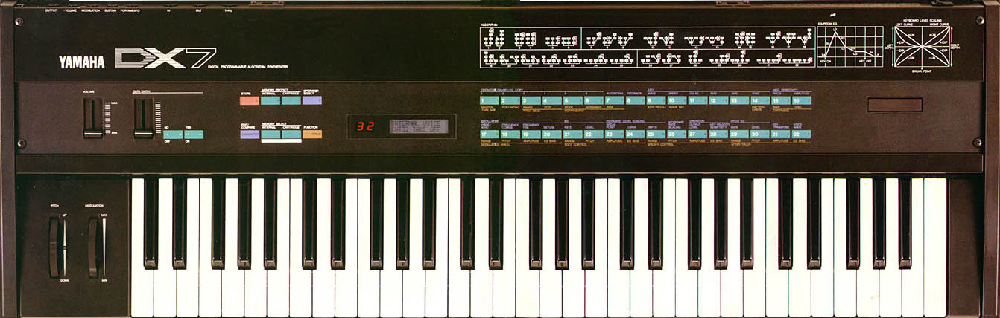
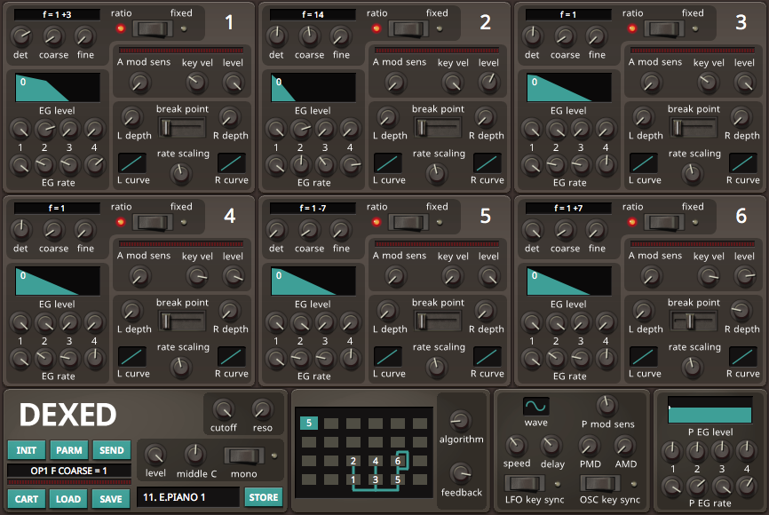

<!-- .slide: data-background-color="#10100b" data-background-image="dx7-bg2.png" data-background-position="top right" data-background-size="auto 80%" data-background-opacity="1" style="text-align:left;padding-top:150px;" -->

<h1 class="white-when-small" style="font-size:1.5em;">The Timbre Is the Instrument</h1>
<h4 class="white-when-small">The Imagined DX7 and  1980s Nostalgia</h4>

Megan L. Lavengood Associate Prof, George Mason University

SAM 2026

---

## Nostalgia and Technological Development (Enders 2017) <!-- .element: class="r-fit-text" -->

1. Instrumentalization
2. Mechanization
3. Automatization
4. Electronification
5. Modularization
6. **Digitalization**
7. **Virtualization**
8. Globalization
9. Informatization/Artificial Intelligence
10. Hybridization

[Enders (2017)](#/bib)

---

 <!-- .element: data-auto-animate="true" -->

## DX7 History

--

<!-- .slide: data-background-image="dx7.jpg" data-background-size="fill" data-background-opacity=".1" data-background-position="top left" data-auto-animate="true" -->

## DX7 History

- Digital FM synth (vs. analog synth or electric piano)
- Released in late 1983
- Ubiquitous in mid- to late-1980s pop music
- Popular due to affordability and new tech
- Especially remarkable **plucked, brassy, and percussive sounds**

--

<!-- .slide: data-background-image="dx7.jpg" data-background-size="fill" data-background-opacity=".1" data-background-position="top left" data-auto-animate="true" -->

## DX7 History

- Popularized the use of **presets**
- `E. PIANO 1`, short for "electric piano", might be the most popular

<figure><audio src="beauty.mp3" controls></audio><figcaption>Celine Dion, "Beauty and the Beast" (1991)</figcaption></figure>

--

## DX7 History

<!-- .slide: data-background-image="dx7.jpg" data-background-size="fill" data-background-opacity=".1" data-background-position="top left" data-auto-animate="true" -->

- DX7 was marketed as an all-in-one alternative to a keyboard collection
- `E. PIANO 1` was often compared to Fender Rhodes and referred to as the "Rhodes sound"
- Sounds are not that similar, but `E. PIANO 1` was nevertheless popular

--

## DX7 History

<!-- .slide: data-background-image="dx7.jpg" data-background-size="fill" data-background-opacity=".1" data-background-position="top left" data-auto-animate="true" -->

<figure><video data-autoplay controls src="media/dx7-rhodes.mov" alt="video comparison of DX7 and Rhodes"></video><figcaption>DX7 (left) vs. Rhodes (right)</figcaption></figure>

---

## Imitators

- Roland D-50
- Korg M1
- Other Yamaha instruments
- VSTs

--

<!-- .element: data-auto-animate="true" -->

## Roland D-50

--

<!-- .slide: data-background-image="d50.png" data-background-size="fill" data-background-opacity=".1" data-background-position="bottom" data-auto-animate="true" -->

## Roland D-50

- Released in 1987
- Preset name: `Synthetic Electric`—this is meant to sound like _a synth_, not like a Rhodes!

> The only disappointment is the electric piano, which doesn't match the DX7's and sounds more like a Wurlitzer. ([Gavin 1987](#/bib))

--

<!-- .element: data-auto-animate="true" -->

## Roland D-50

<figure><video controls src="media/dx7-rhodes-d50se.mov" alt="video comparison of DX7 and Rhodes"></video><figcaption>DX7 (left) vs. Rhodes (center) vs. Roland D-50 Synthetic Electric (right)</figcaption></figure>

--

 <!-- .element: data-auto-animate="true" -->

## Yamaha Clavinova

--

<!-- .slide: data-background-image="clavinova.png" data-background-size="fill" data-background-opacity=".2" data-background-position="top" data-auto-animate="true" -->

## Yamaha Clavinova

- Originally released in 1983 but still produced today
- A family of instruments; substitutes for acoustic piano (e.g., in homes, schools, churches)
- Two electric piano presets:
    1. `E. PIANO 1` sound
    2. Fender Rhodes sound

--

<!-- .element: data-auto-animate="true" -->

## Yamaha Clavinova

<figure><video controls src="media/dx7-rhodes-clav.mov" alt="video comparison of DX7 and Rhodes"></video><figcaption>DX7 — Clavinova EP 1 — Rhodes — Clavinova EP2</figcaption></figure>

--

<!-- .element: data-auto-animate="true" -->

## VSTs: Dexed

--

<!-- .slide: data-background-image="dexed.png" data-background-size="fill" data-background-opacity=".1" data-background-position="bottom left" data-auto-animate="true" -->

## VSTs: Dexed

- Open-source VST (standalone and plugin)
- Released in 2015 by Digital Suburban
- “closely modeled on the original DX7 characteristics” ([Gauthier n.d.](#/bib))
- Produces virtually identical `E. PIANO 1` sound

--

<!-- .element: data-auto-animate="true" -->

## VSTs: Dexed

<figure><video controls src="media/dx7-dexed.mov" alt="video comparison of DX7 and Rhodes"></video><figcaption>DX7 — Dexed</figcaption></figure>

--

<h2 style="text-align:left;">Comparisons</h2>

<!--
| _timbre ↓_&emsp;**inst →** | **DX7** | **CLP&nbsp;1** | **D&#8209;50** | **Dexed** |
| -------------------------: | :-----: | :------------: | :------------: | :-------: |
|            _bright / dark_ |    −    |       −        |       −        |     −     |
|             _pure / noisy_ |    −    |       −        |       +        |     −     |
|            _hollow / full_ |    −    |       −        |       +        |     −     |
|            _sparse / rich_ |    −    |       −        |       +        |     −     |
|       _beating / beatless_ |    −    |       +        |       −        |     −     |
|        _steady / wavering_ |    −    |       −        |       −        |     −     |
|       _harmonic / inharm._ |    −    |       −        |       −        |     −     |

|                         |     |     |       |       |       |       |       |
| ----------------------- | --- | --- | ----- | ----- | ----- | ----- | ----- |
| _bright / dark_         | −   | −   | −     | −     | **+** | −     | **+** |
| _pure / noisy_          | −   | −   | −     | **+** | −     | **+** | −     |
| _hollow / full_         | −   | −   | −     | **+** | **+** | **+** | **+** |
| _sparse / rich_         | −   | −   | −     | **+** | **+** | **+** | **+** |
| _beating / beatless_    | −   | −   | **+** | −     | **+** | **+** | **+** |
| _steady / wavering_     | −   | −   | −     | −     | −     | **+** | −     |
| _harmonic / inharmonic_ | −   | −   | −     | −     | **+** | **+** | **+** | -->

<table class="comp-table">
<thead style="vertical-align:bottom;">
<tr>
<th style="text-align:right;"><em style="font-style:unset;">timbre ↓</em>&emsp;&emsp;&emsp;<strong style="color:unset;">inst →</strong></th>
<th class="rotated-text" style="text-align:center;">
DX7
</th>
<th class="rotated-text" style="text-align:center;">
Dexed
</th>
<th class="rotated-text" style="text-align:center;">
Clavinova EP 1
</th>
<th class="rotated-text" style="text-align:center;">
D-50 Synthetic Electric
</th>
<th class="rotated-text" style="text-align:center;">
Clavinova EP 2
</th>
<th class="rotated-text" style="text-align:center;">
D-50 PCM EP
</th>
<th class="rotated-text" style="text-align:center;">
Rhodes
</th>
</tr>
</thead>
<tbody>
<tr>
<td><em>bright / dark</em></td>
<td>−</td>
<td>−</td>
<td>−</td>
<td>−</td>
<td><strong>+</strong></td>
<td>−</td>
<td><strong>+</strong></td>
</tr>
<tr>
<td><em>pure / noisy</em></td>
<td>−</td>
<td>−</td>
<td>−</td>
<td><strong>+</strong></td>
<td>−</td>
<td><strong>+</strong></td>
<td>−</td>
</tr>
<tr>
<td><em>hollow / full</em></td>
<td>−</td>
<td>−</td>
<td>−</td>
<td><strong>+</strong></td>
<td><strong>+</strong></td>
<td><strong>+</strong></td>
<td><strong>+</strong></td>
</tr>
<tr>
<td><em>sparse / rich</em></td>
<td>−</td>
<td>−</td>
<td>−</td>
<td><strong>+</strong></td>
<td><strong>+</strong></td>
<td><strong>+</strong></td>
<td><strong>+</strong></td>
</tr>
<tr>
<td><em>beating / beatless</em></td>
<td>−</td>
<td>−</td>
<td><strong>+</strong></td>
<td>−</td>
<td><strong>+</strong></td>
<td><strong>+</strong></td>
<td><strong>+</strong></td>
</tr>
<tr>
<td><em>steady / wavering</em></td>
<td>−</td>
<td>−</td>
<td>−</td>
<td>−</td>
<td>−</td>
<td><strong>+</strong></td>
<td>−</td>
</tr>
<tr>
<td><em>harmonic / inharmonic</em></td>
<td>−</td>
<td>−</td>
<td>−</td>
<td>−</td>
<td><strong>+</strong></td>
<td><strong>+</strong></td>
<td><strong>+</strong></td>
</tr>
</tbody>
</table>

--

The DX7 `E. PIANO 1` gradually becomes at least as recognizable and imitated as the Rhodes.

---

<!-- .slide: data-background-image="versace.png" data-background-size="cover" data-background-opacity=".2" data-background-position="bottom right" data-auto-animate="true" -->

## Versace on the Floor

performed by Bruno Mars

on _24k Magic_ (2016)

--

## Versace on the Floor

<figure><audio src="media/beauty.mp3" controls></audio><figcaption>Celine Dion, "Beauty and the Beast" (1991)</figcaption></figure>

<figure><audio src="media/versace-orig-clip.mp3" controls></audio><figcaption>Bruno Mars, "Versace on the Floor" (2016)</figcaption></figure>

---

<!-- .slide: id="bib" -->

## Thanks

<!-- .element: data-preview-image data-preview-fit="contain" -->

↑ [Bibliography](https://www.zotero.org/mlavengood/collections/5P4J3M25/collection)
